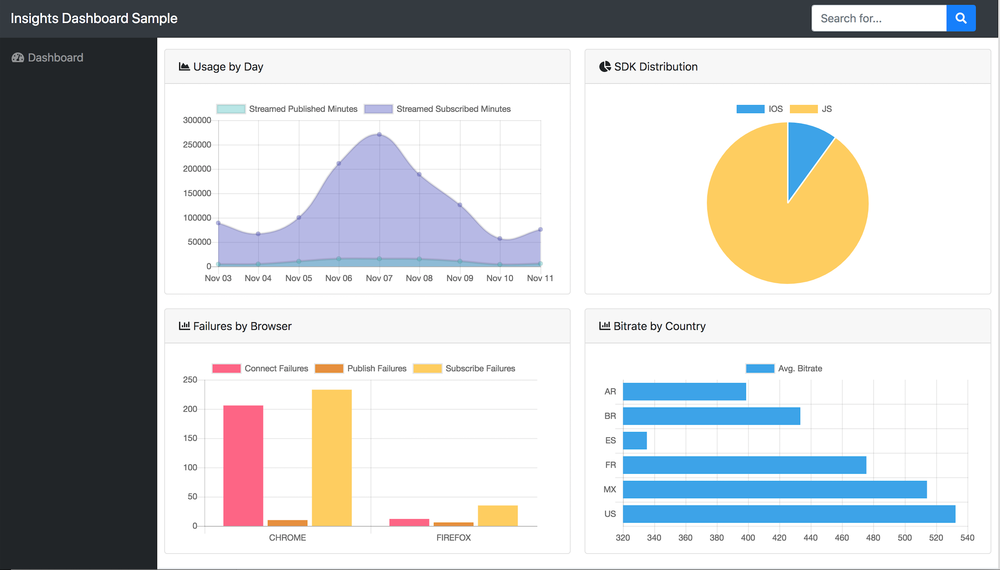
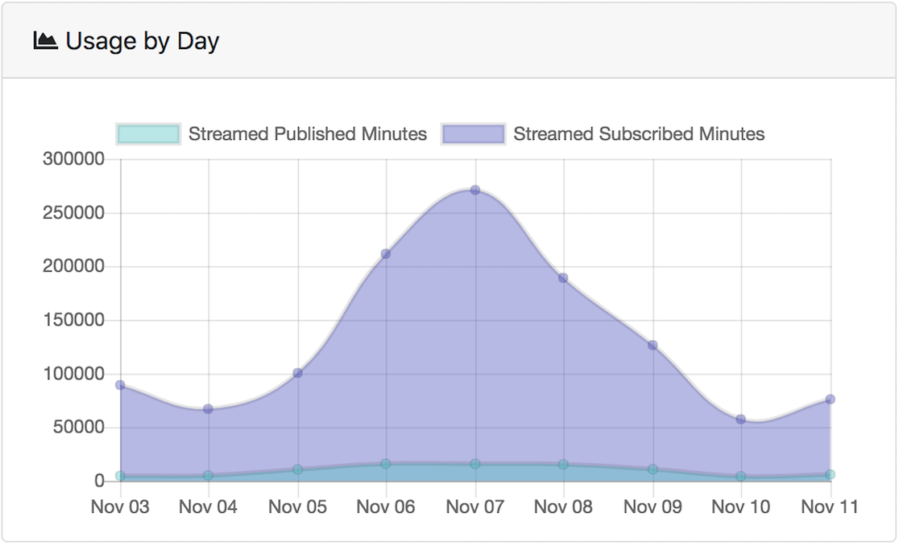
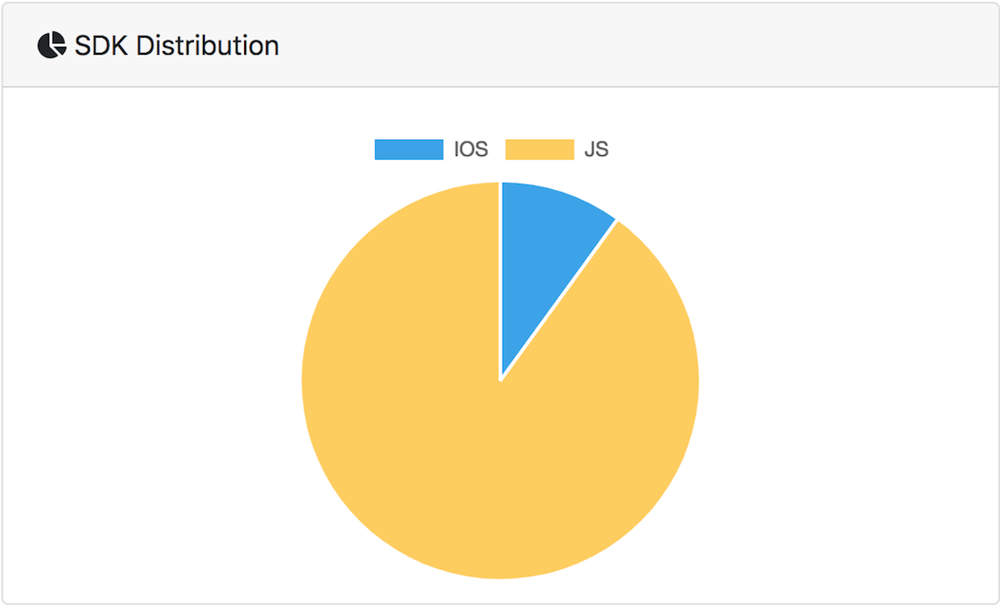
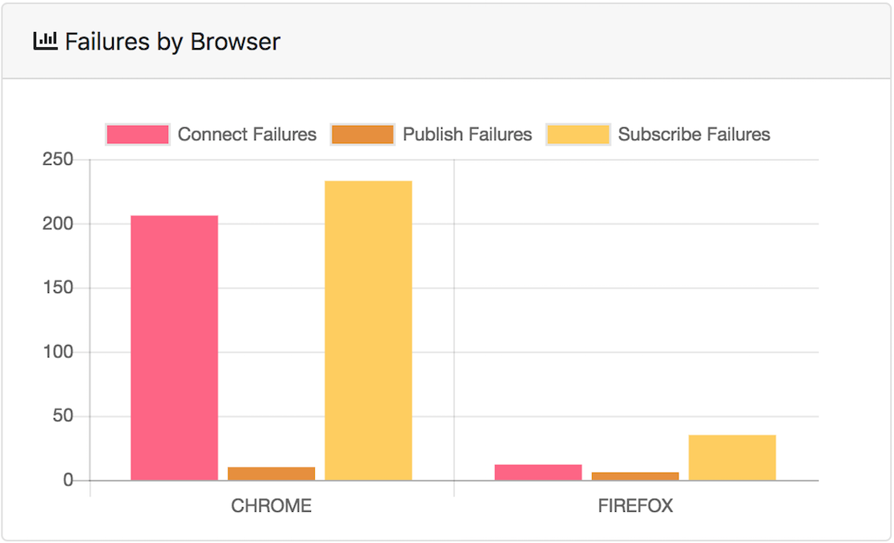
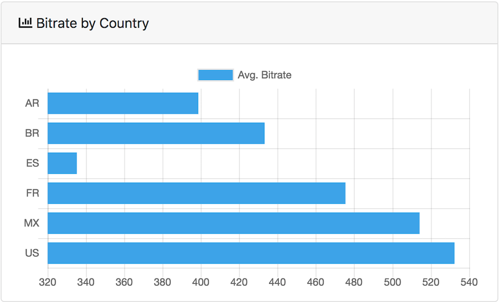
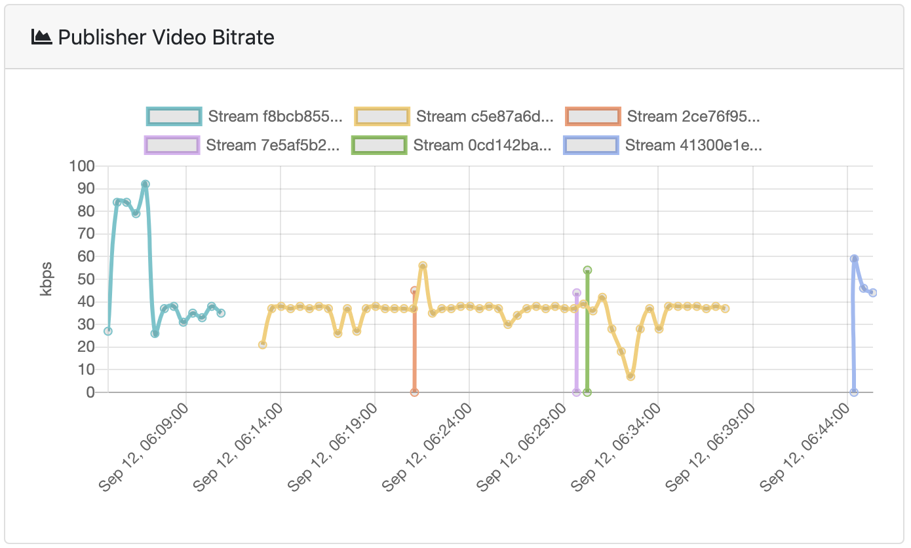
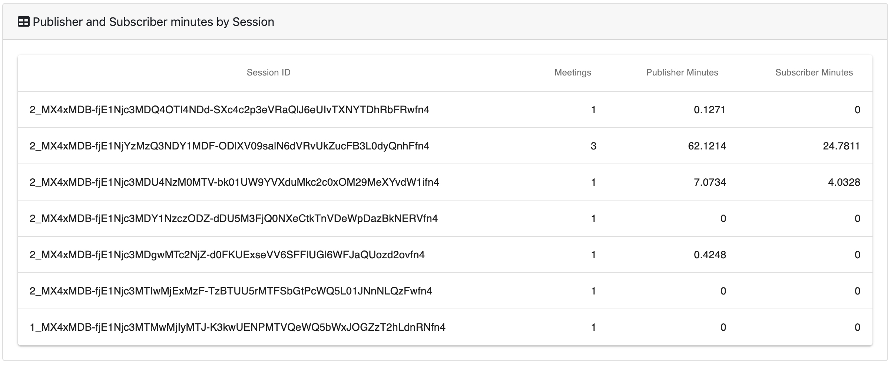

# Insights Dashboard Sample
Dashboard Sample which makes use of OpenTok Insights GraphQL API

## Preview



## Local Installation

1. Clone the repository.

2. If you are using nvm, run `nvm use` to use the version of Node from the .nvmrc file.

3. Install dependencies: `npm install`.

4. Copy `.env.template` to `.env` and edit the environment variables.

5. Run the server and the client app: `npm start`. This will run both
   the server (server.js) and the client app (react-scripts).

Open http://localhost:3000 in your browser.

## Configuration options

Configuration can be done using environment variables. You can create
an `.env` file for easier config.

Environment Variable Names and Description:

- `REACT_APP_INSIGHTS_URL` (Required): The URL for the OpenTok Insights API server.
- `REACT_APP_API_KEY` (Required): Your OpenTok API Key.
- `API_SECRET` (Required): Your OpenTok API Secret.
- `SERVER_PORT` (Required): The port number for your server to run on.
- `REACT_APP_SERVER_URL` (Required): The URL for your server app.
- `APP_CLIENT_URL` (Required): The URL for your client app.

Notice that all the environment variables used by the client start with `REACT_APP_`.
This ensures that only those are accessible by the client, protecting your API secret.

## Charts - Query samples

### Usage by Day



#### Query to Insights API (Sample)
```
{
  project(projectId: ${YOUR_API_KEY}) {
    projectData(
      start: ${moment().subtract(10, 'days')},
      interval: DAILY
    ) { 
      resources {
        intervalStart,
        intervalEnd,
        usage {
          streamedPublishedMinutes,
          streamedSubscribedMinutes
        }
      }
    }
  }
}
```

### SDK Distribution



#### Query to Insights API (Sample)
```
{
  project(projectId: ${YOUR_API_KEY}) {
    projectData(
      start: ${moment().subtract(10, 'days')},
      groupBy: SDK_TYPE,
      sdkType: [JS, ANDROID, IOS]
    ) {
      resources {
        sdkType,
        usage {
          streamedSubscribedMinutes
        }
      }
    }
  }
}
```

### Failures by Browser



#### Query to Insights API (Sample)
```
{
  project(projectId: ${YOUR_API_KEY}) {
    projectData(
      start: ${moment().subtract(10, 'days')},
      groupBy: BROWSER_NAME,
      browserName: [CHROME, FIREFOX, IE]
    ) { 
      resources {
        browserName,
        errors {
          guidConnect {
            failures
          },
          guidPublish {
            failures
          },
          guidSubscribe {
            failures
          }
        }
      }
    }
  }
}
```

### Bitrate by Country



#### Query to Insights API (Sample)
```
{
  project(projectId: ${YOUR_API_KEY}) {
    projectData(
      start: ${moment().subtract(10, 'days')},
      groupBy: COUNTRY,
      country: [AR, BR, ES, FR, MX, US]
    ) {
      resources {
        country,
        quality {
          subscriber {
            videoBitrateAvg
          }
        }
      }
    }
  }
}
```

### Publisher video bitrate for a meeting



#### Query to Insights API (Sample)

##### This query will return all your session IDs from the last 10 days.
```
{
  project(projectId: ${YOUR_API_KEY}) {
    sessionData {
      sessionSummaries(start: ${moment().subtract(10, 'days')}) {
        totalCount
        resources {
          sessionId
        }
      }
    }
  }
}
```

##### You can then get the stream statistics (such as the video bitrate) for for publishers and subscribers in a session:
```
{
  project(projectId: ${YOUR_API_KEY}) {
    sessionData {
      sessions(sessionIds: ["${YOUR_SESSION_ID}"]) {
        resources {
          publisherMinutes
          meetings {
            resources {
              publishers {
                totalCount
                resources {
                  stream {
                    streamId
                  }
                  streamStatsCollection {
                    resources {
                      videoBitrateKbps
                      createdAt
                    }
                  }
                }
              }
            }
          }
        }  
      }
    }
  }
}
```

### Publisher and Subscriber minutes by Session



#### Query to Insights API (Sample)

##### This query will return pages (50 results each) of your session IDs from the last 10 days:
```
{
  project(projectId: ${YOUR_API_KEY}) {
    sessionData {
      sessionSummaries(
        start: ${moment().subtract(10, 'days')}
        endCursor: "${END_CURSOR}"
      ) {
        totalCount
        pageInfo {
          endCursor
        }
        resources {
          sessionId
        }
      }
    }
  }
}
```

Note that you use the `endCursor` value of the returned `pageInfo` data as the
input `endCursor` parameter to obtain the next page of data. For more information, see
[Using Pagination in Queries](https://tokbox.com/developer/guides/insights/#using-pagination-in-queries).

##### You can then get the total publisher and subscriber minutes for a single session as follows:
```
{
  project(projectId: ${YOUR_API_KEY}) {
    sessionData {
      sessions(sessionIds: ["${YOUR_SESSION_ID}"]) {
        resources {
          sessionId
          publisherMinutes
          subscriberMinutes
          meetings {
            totalCount
          }
        }
      }
    }
  }
}
```

##### Additionally, you can get the publisherMinutes and subscriberMinutes of each one of the meetings in the session.
```
{
  project(projectId: ${YOUR_API_KEY}) {
    sessionData {
      sessions(sessionIds: ["${YOUR_SESSION_ID}"]) {
        resources {
          meetings {
            resources {
              meetingId
              publisherMinutes
              subscriberMinutes
            }
          }
        }
      }
    }
  }
}
```